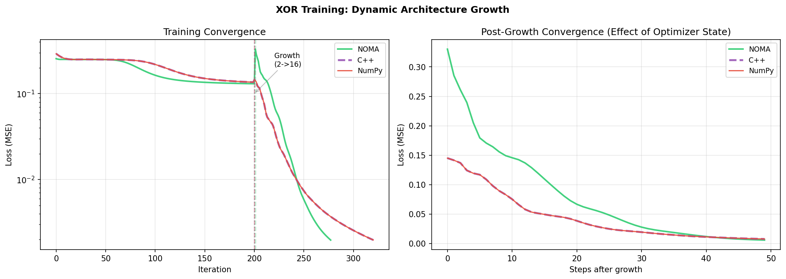

<p align="center">
  
</p>

# NOMA
**Neural-Oriented Machine Architecture**

A research-driven systems language for machine learning where **autodiff is a compiler pass** and **model parameters are explicit, growable memory**.

[](https://github.com/pierridotite/Noma)
[](https://github.com/pierridotite/Noma/stargazers)
[](https://discord.gg/GCYvkJWsPf)

**[Language Guide](LANGUAGE_GUIDE.md) · [Contributing](CONTRIBUTING.md) · [Discord](https://discord.gg/GCYvkJWsPf)**

---
## Table of Contents

- [News](#-news)
- [What's NOMA ?](#whats-noma-)
- [Where the idea came from (short origin story)](#where-the-idea-came-from-short-origin-story)
- [Dynamic topology growth (what realloc is trying to mean)](#dynamic-topology-growth-what-realloc-is-trying-to-mean)
- [XOR demo (first result, kept short)](#xor-demo-first-result-kept-short)
- [Quick start](#quick-start)
- [Project status (alpha)](#project-status-alpha)
- [Scientific context (selected references)](#scientific-context-selected-references)
  - [Topology changes while reusing learned information](#topology-changes-while-reusing-learned-information)
  - [Biological inspiration: structural plasticity and stability](#biological-inspiration-structural-plasticity-and-stability)
  - [Compiler-level / IR-level autodiff (adjacent area)](#compiler-level--ir-level-autodiff-adjacent-area)
- [Contributing](#contributing)
- [Citation](#citation)

---

## 🔥 News 

- [2025-12-31] [Jupyter notebook extension](notebook/) with `%%noma` cell magic for interactive development
- [2025-12-30] [Self-growing XOR demo](demo_self_growing_xor/) (reproducible)
- [2025-12-25] Initial presentation of NOMA

*All informations on [changelog](CHANGELOG.md)*

---

## What's NOMA ?

NOMA explores a different boundary between language and ML framework:

- Reverse-mode autodiff as a **compiler transformation** (LLVM IR)
- Training loops as a **language construct** (optimize { ... })
- Learnable parameters as **explicit buffers** you can alloc / realloc / free
- Intent: topology changes (growth, resizing) should be mechanically defined, including what happens to optimizer state

---

## Where the idea came from (short origin story)

I started NOMA after running into the same friction many times: in mainstream ML stacks, changing a model’s topology mid-training often means rebuilding graphs, copying weights, and resetting optimizer state.

Biology suggests a different mental model. Nervous systems remain functional while continuously reshaping their micro-structure. Work on dendritic spine structural plasticity connects local structural remodeling to synaptic efficacy and learning/memory. That makes it a reasonable working hypothesis (not a claim of equivalence) that some forms of “local learning” can be preserved while the global structure changes.

On the ML side, there is also prior work showing that you can change network structure while preserving function (or at least reusing learned information) to reduce the cost of re-training (e.g., Net2Net, Network Morphism).

NOMA is my attempt to make these topology changes explicit and well-defined at the language level.

---

## Dynamic topology growth (what realloc is trying to mean)

realloc grows a learnable parameter buffer while preserving existing values. The goal is to also preserve optimizer state for the existing portion (e.g., Adam moments), so training can continue without a full restart.

```noma
fn main() {
    learn W = tensor [[0.1], [0.2]];  // start small

    optimize(W) with adam(0.01) until loss < 0.01 {
        let pred = matmul(X, W);
        let loss = mean((pred - Y) * (pred - Y));

        if loss > 0.5 {
            realloc W = [10, 1];      // grow capacity, keep training
        }

        minimize loss;
    }

    return W;
}
````

---

## XOR demo (first result, kept short)

We include a small, fully reproducible self-growing XOR toy benchmark to sanity-check the semantics.

<p align="center">
  
</p>

In this demo, after the growth step, the configuration that preserves optimizer state across realloc reconverges faster than a baseline that resets state. This is an early, limited result on a toy task useful as a first signal, not a performance claim.

Full scripts, plots, and notes are in [demo_self_growing_xor/](demo_self_growing_xor/).

---

## Quick start

```bash
git clone https://github.com/pierridotite/Noma.git
cd Noma
cargo build --release

# Interpreter mode
cargo run -- run examples/03_gradient_descent.noma

# Compile to a standalone binary
cargo run -- build-exe examples/12_linear_regression.noma -o model
./model
```

---

## Project status (alpha)

Working today (high level):

* parser + AST
* reverse-mode autodiff
* LLVM IR codegen (basic tensor ops)
* SGD / Adam / RMSprop
* alloc / realloc / free
* user-defined functions with autodiff support
* batch processing + I/O (CSV, Safetensors)

Known limitations (high level):

* single numeric type (f64)
* no module system (single-file programs)
* control flow is limited
* debugging is minimal

---

## Scientific context (selected references)

### Topology changes while reusing learned information

* **Net2Net: Accelerating Learning via Knowledge Transfer**   Chen, Goodfellow, Shlens (2015).
  [https://arxiv.org/abs/1511.05641](https://arxiv.org/abs/1511.05641)
* **Network Morphism**   Wei, Wang, Rui, Chen (2016).
  [https://arxiv.org/abs/1603.01670](https://arxiv.org/abs/1603.01670)
* **Lifelong Learning with Dynamically Expandable Networks (DEN)**   Yoon et al. (2017/2018).
  [https://arxiv.org/abs/1708.01547](https://arxiv.org/abs/1708.01547)

### Biological inspiration: structural plasticity and stability

* **Structural and functional plasticity of dendritic spines**   Gipson & Olive (2016, review).
  [https://pmc.ncbi.nlm.nih.gov/articles/PMC5243184/](https://pmc.ncbi.nlm.nih.gov/articles/PMC5243184/)
* **Dendritic Spines: The Locus of Structural and Functional Plasticity**   Sala & Segal (2014, review).
  [https://pubmed.ncbi.nlm.nih.gov/24382885/](https://pubmed.ncbi.nlm.nih.gov/24382885/)

### Compiler-level / IR-level autodiff (adjacent area)

* **Enzyme** (LLVM IR automatic differentiation; project site).
  [https://enzyme.mit.edu/](https://enzyme.mit.edu/)
* **Instead of rewriting foreign code for machine learning, automatically synthesize fast gradients**   Moses & Churavy (2020).
  [https://arxiv.org/abs/2010.01709](https://arxiv.org/abs/2010.01709)
* **Don't Unroll Adjoint: Differentiating SSA-Form Programs**   Innes (2018).
  [https://arxiv.org/abs/1810.07951](https://arxiv.org/abs/1810.07951)

---

## Contributing

Issues and PRs are welcome ! Especially around ops, diagnostics, optimizers, docs, and backend work.

See: [CONTRIBUTING.md](CONTRIBUTING.md)

## Citation

If you want to cite NOMA in a scientific paper, please use the following reference; BibTeX snippet below :
```BibTeX
@software{NOMA,
  author  = {NOMA Authors},
  title   = {NOMA: Neural-Oriented Machine Architecture},
  year    = {2025},
  version = {alpha},
  url     = {https://github.com/pierridotite/NOMA},
  note    = {Accessed: [date you accessed, e.g. 12/30/2025]}
}
```


